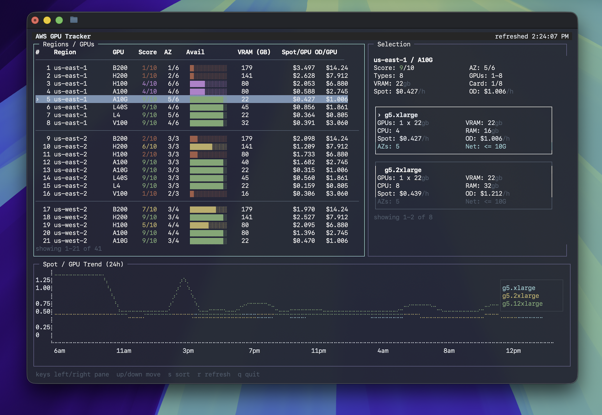

# spotter

MacOS terminal dashboard for tracking GPU availability on AWS



## Requirements

- Node.js 20+
- AWS CLI v2
- AWS credentials configured locally

## Install

Directly from this repo:

```bash
npm install -g https://github.com/hallofstairs/spotter.git
spotter
```

## Usage

Run the dashboard:

```bash
spotter
```

One-shot snapshot:

```bash
spotter --once
```

Useful examples:

```bash
spotter --regions us-east-1,us-west-2 --gpu-models H100,A100
spotter --regions all
spotter --target-instances 8
spotter --history-hours 24
spotter --profile my-profile
```


## Notes

- `npm link` exposes the CLI globally as `spotter`.
- `Score`: EC2 Spot placement score from `1-10`; higher is better
- `AZ`: `offered/total` Availability Zone coverage for that GPU family in the region


